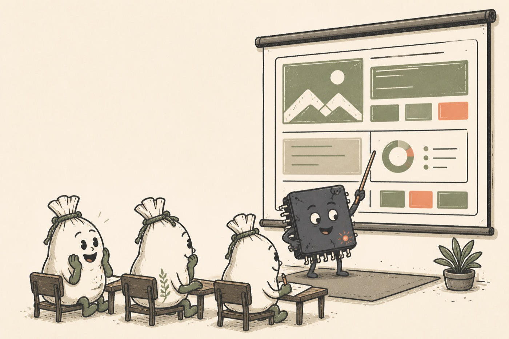
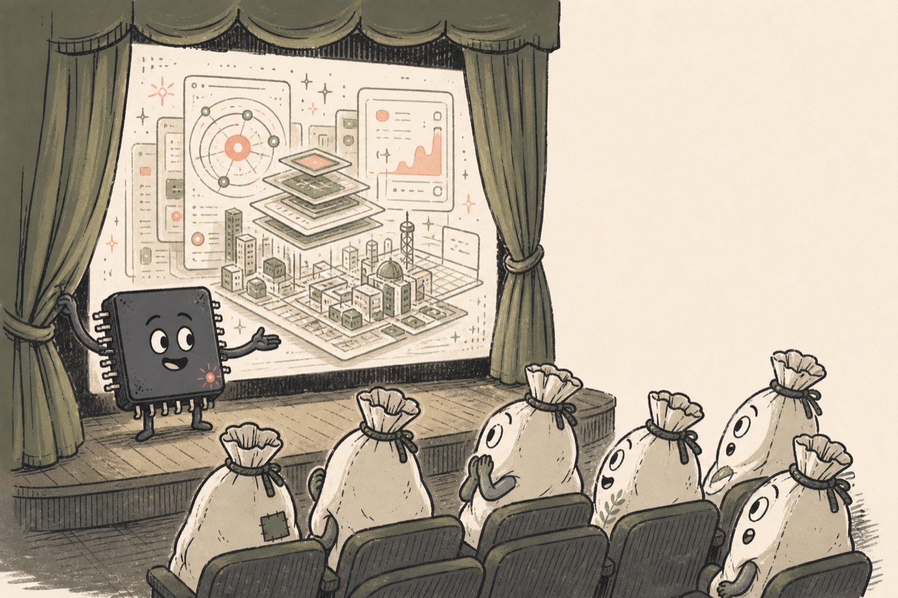
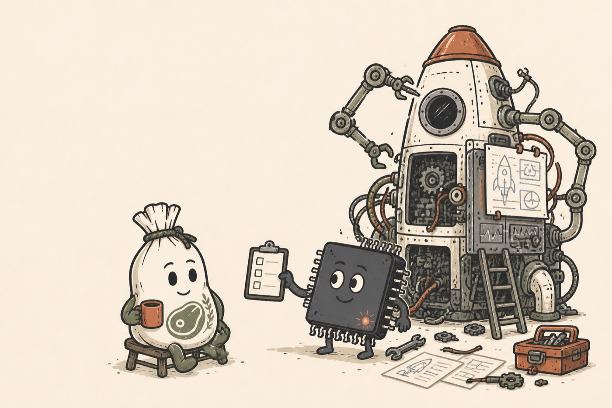
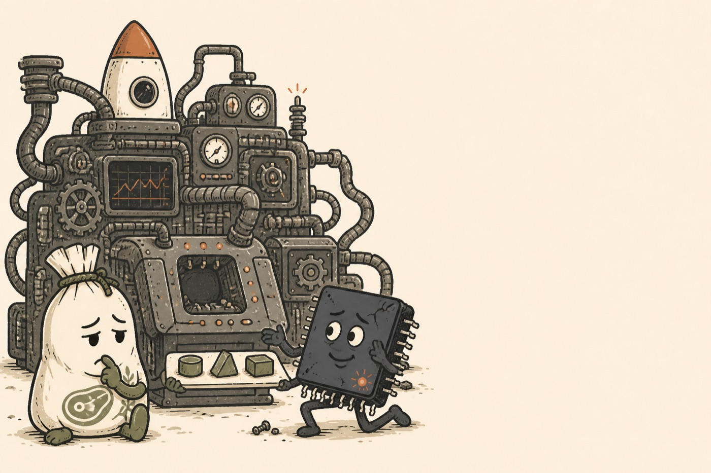

# Silicon and meat sacks

This guide keeps the characters recognisable across showmeatsack.com and
askmeatsack.com. It covers their appearance, relationship and role in each product.

The characters are colleagues. Silicon does fast, complicated work. Meat sacks supply
context, judgement and approval. Neither character exists to make the other look stupid.

## The cast

### Silicon

Silicon is a small, square computer chip with an expressive face, thin arms and legs, and
visible pins around the body.

Keep these features:

- A charcoal or near-black ceramic body with softly rounded corners.
- Cream eyes with dark pupils. Eyebrows carry much of the expression.
- A small ember status light near the lower-right corner.
- Fine charcoal limbs and chip pins. Hands may simplify to mitten shapes.
- An eager, capable manner. Silicon enjoys the work and takes it seriously.

Silicon may hold a pointer, clipboard, tool or component. Props should clarify the action
rather than turn the character into a generic robot.

Silicon is intact during ordinary product scenes. Cracks, smoke and failed lights belong
to errors and outages. Keeping damage for failure states preserves its meaning.

### Meat sacks

A meat sack is a warm cream cloth sack tied at the top, with a soft pear-shaped body,
simple features and olive limbs.

Keep these features:

- Off-white cloth with loose ink texture and a gathered top.
- An olive cord tied around the neck of the sack.
- Dark oval eyes, small eyebrows and a simple mouth.
- Muted kelp hands and feet.
- A kelp steak-cut emblem on the front when the body faces the viewer.
- A soft, weighted posture. The bottom of the sack settles against chairs and floors.

Meat sacks may vary in height, build, age and expression. A group should look like
individuals from the same visual family, not copies stamped from one pose.

The character is a cloth mascot, not exposed flesh. Avoid blood, realistic meat, veins,
teeth and body horror.

## Their relationship

Silicon and meat sacks work together.

- Silicon handles scale, speed and technical complexity.
- Meat sacks provide intent, taste, missing facts and final judgement.
- Silicon can ask, explain, present, wait, recover and try again.
- Meat sacks can consider, question, choose, approve and be impressed.
- Both characters should look engaged in the same task.

Avoid master-and-servant compositions. Do not show silicon lecturing fools, or a meat sack
ordering around a disposable machine. The joke comes from the literal product names and
the difference in their strengths.

## Product stories

### showmeatsack.com

Silicon has made or found something worth seeing and presents it to one or more meat sacks.
The finished work should occupy a visible screen, stage, board or display.

Useful scenes:

- A classroom presentation with silicon pointing at a projected page.
- A theatre reveal with meat sacks in the audience.
- Silicon wheeling a large finished screen into a meeting.
- A gallery opening where the exhibit is a page rather than a painting.

The meat sacks should be looking at the work, not at the viewer. Silicon may look towards
the work or the audience. The composition should make the act of showing clear without
written explanation.

Use kelp green as the product accent. Ember can appear in silicon's status light and a few
small details.

### askmeatsack.com

Silicon is building something ambitious and pauses because human context is missing. The
question should look small and specific beside the scale of the work.

Useful scenes:

- A workshop where silicon pauses a rocket build and offers a short clipboard.
- A nearly complete machine with one empty socket and a few possible parts.
- A control room where one decision holds the final launch.
- A drafting table where silicon needs the meat sack to choose between two plans.

The meat sack should look thoughtful rather than obstructive. Silicon should look patient
and purposeful, not helpless. The invention in progress shows that the question supports a
larger piece of work.

Use ember orange as the product accent. Kelp may appear on the meat sack and in small
workshop details.

## Drawing language

The established style resembles a lightly imperfect editorial screen print.

- Warm cream paper background.
- Charcoal outlines with varied, hand-drawn weight.
- Flat muted colour fills. Avoid glossy rendering and gradients.
- Sparse stipple, scuffs and misregistration for texture.
- Rounded forms and readable silhouettes.
- Friendly expressions with restrained exaggeration.
- No photorealism, 3D rendering, pixel art or polished corporate vector gloss.

Illustrations should work at small sizes. Keep faces, hands and the central action clear.
Background machinery may carry detail, but it must not swallow the characters.

## Composition for product pages

- Favour a wide 16:9 or 3:2 scene for a homepage hero.
- Reserve a quiet area for live HTML copy. Do not place text inside the illustration.
- Keep important faces and props away from crop edges.
- Let the product action read before the decorative details.
- Use real interface shapes only as abstract blocks. Generated text and tiny UI labels
  quickly look broken.
- Provide descriptive alt text that names the action, not every prop.

## Failure scenes

The 500-page illustration establishes the failure variant:

- Silicon may crack, smoke or show a warning light.
- The meat sack may look disappointed or tired.
- The tone stays affectionate. Nobody is injured and nothing becomes frightening.
- Error copy remains plain even when the picture carries the joke.

Do not reuse the damaged silicon design on the homepage. A cracked chip outside an error
state makes the product look unreliable.

## Reference scenes

### showmeatsack.com

The classroom is the clearest literal expression of the product. It establishes the
pointer, attentive audience and kelp-led palette.

The theatre adds ceremony and suits launches, showcases and presentations.

### askmeatsack.com

The workshop captures the core askmeatsack.com story: substantial work is under way and a
small amount of human context lets it continue.

The final-detail scene makes choice and judgement visible without relying on form fields or
written questions.

### Error state

`public/silicon-failure.png` is the canonical failure reference. Use it for the character
shapes, ink treatment and failure-only damage cues.

## Reusable image brief

Start new image prompts with this foundation:

> Use the established showmeatsack.com character family and handmade editorial screen-print
> style. Silicon is a small intact charcoal computer chip with expressive cream eyes, thin
> limbs, visible pins and one ember status light. Meat sacks are warm cream tied cloth
> characters with olive limbs, simple expressive faces and a muted kelp steak-cut emblem.
> Use charcoal linework, flat muted colours, subtle paper texture and a warm cream ground.
> Keep both characters capable and collaborative. No text, logos, gore, photorealism, 3D
> rendering or gradients.

Add the product scene, accent colour, composition and required copy space after that block.

## Continuity check

Before accepting a new illustration, check:

- Silicon reads as a chip rather than a monitor, robot or phone.
- The ember status light sits near the lower-right corner.
- Ordinary silicon is intact; damage appears only in a failure scene.
- Meat sacks look like tied cloth mascots and carry the kelp body mark when visible.
- Both characters have agency and understand the same task.
- The scene explains showing or asking without embedded words.
- showmeatsack.com leads with kelp; askmeatsack.com leads with ember.
- The ink, palette and paper texture match the reference scenes.
- The crop leaves enough quiet space for the real page copy.
